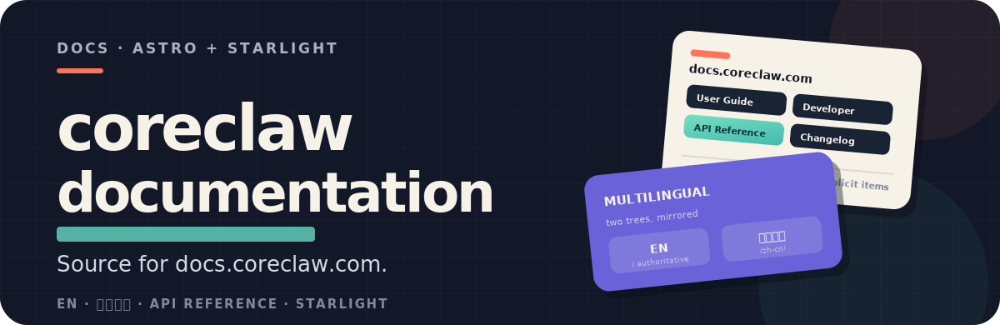
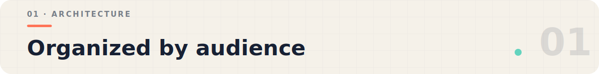
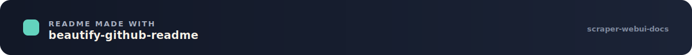

# CoreClaw Documentation

<p align="center">
  
</p>

Source content and configuration for [docs.coreclaw.com](https://docs.coreclaw.com/), built with [Astro](https://astro.build/) and [Starlight](https://starlight.astro.build/).

Chinese version: [`README.zh-CN.md`](./README.zh-CN.md)

<p align="center">
  
</p>

## Documentation Architecture

CoreClaw documentation is organized by audience:

### Content Areas

| Area | Audience | Content |
|------|----------|---------|
| User Guide | End users | Running Workers, viewing results, billing, API usage, FAQ |
| Developer Guide | Worker developers | Building, testing, publishing, and monetizing Workers |
| API Reference | API consumers | Full endpoint docs with request/response schemas |
| Website Events | All users | Platform events and promotions |
| Changelog | All users | Platform and documentation updates |

### Multilingual Structure

- **English** (`/`) — Default language, authoritative source
- **Simplified Chinese** (`/zh-cn/`) — Full translation, maintained in parallel

The directory structures under `src/content/docs/` and `src/content/docs/zh-cn/` mirror each other. Changes should be kept in sync across both languages.

## Key Conventions

### Worker / Scraper Terminology

CoreClaw uses two terms for the same concept:

- **Worker** — The name used in documentation and the UI; refers to data collection scripts
- **Scraper** — The name retained in some API field names for backward compatibility (e.g., `scraper_slug`, `scraper_title`)

### API Documentation

The public API is **v2**, based at `https://openapi.coreclaw.com` with paths under `/api/v2`. The reference is organized by resource:

- **Workers** — `/api/v2/workers/*` for listing Workers, reading input schema, and starting runs
- **Worker Tasks** — `/api/v2/worker-tasks/*` for saved task templates (create, read, update, delete, run)
- **Worker Runs** — `/api/v2/worker-runs/*` for run history, detail, results, logs, exports, rerun, and abort
- **Account / Store / Proxy** — `/api/v2/users/account`, `/api/v2/store`, `/api/v2/proxy/region`

Each endpoint page documents the HTTP method, path, request parameters, response schema, and error codes. The [API index page](https://docs.coreclaw.com/api/) provides a complete endpoint quick-reference.

The API reference pages, `public/openapi.json`, and the language examples are **generated** by `scripts/generate-api-v2-docs.mjs` from the source OpenAPI contract — edit the generator, then regenerate, rather than editing generated pages by hand. The spec is served at `/openapi.json`.

### Sidebar Configuration

Navigation is defined manually via explicit `items` arrays in `astro.config.mjs`, giving full control over:
- Section labels and ordering
- Multilingual label translations
- Collapsible groups and nesting
- Badge annotations (e.g., "Required")

## Repository Structure

```
.
├── public/                         # Static assets (copied as-is)
│   ├── openapi.json                #   OpenAPI spec (served at /openapi.json)
│   ├── favicon.jpg                 #   Site favicon
│   └── logo.png                    #   Site logo
├── src/
│   ├── assets/                     # Build-time assets (images, logos)
│   │   └── docs/                   #   Documentation screenshots
│   ├── components/                 # Custom Astro components
│   │   ├── ApiPlayground.astro     #   Interactive API testing form
│   │   ├── CopyForLLMs.astro       #   Copy-for-LLMs header dropdown
│   │   ├── Banner.astro            #   Site banner
│   │   ├── Header.astro            #   Custom page header
│   │   ├── Footer.astro            #   Custom page footer
│   │   └── ...                     #   Other override components
│   ├── content/docs/               # English docs (default language)
│   │   ├── api/                    #   API reference
│   │   ├── developer-guide/        #   Developer docs
│   │   ├── user-guide/             #   User docs
│   │   ├── website-events/         #   Events and promotions
│   │   ├── home.mdx                #   Homepage
│   │   ├── changelog.mdx           #   Changelog
│   │   └── zh-cn/                  # Simplified Chinese mirror
│   ├── pages/                      # Dynamic routes (Copy-for-LLMs .md exports)
│   └── styles/common.css           # Global style overrides
├── scripts/
│   ├── generate-api-v2-docs.mjs        # Generates API reference + openapi.json from the source contract
│   ├── validate-api-v2-docs.mjs        # Static API contract/doc consistency checks
│   ├── check-api-runnable-examples.mjs # Guards example request bodies against regressions
│   ├── check-api-playground-worker-id.mjs # Guards the API playground worker-id handling
│   ├── verify-api-examples.mjs         # Syntax-checks the API language examples
│   ├── check-copy-for-llms.mjs         # Post-build smoke test (.md export completeness)
│   └── live-api-v2-*.mjs               # Opt-in authenticated live checks (not run in build)
├── astro.config.mjs                # Astro + Starlight configuration
├── package.json
└── tsconfig.json
```

## Tech Stack

| Component | Purpose |
|-----------|---------|
| [Astro](https://astro.build/) | Static site generation |
| [Starlight](https://starlight.astro.build/) | Documentation theme (sidebar, search, i18n) |
| [React](https://react.dev/) | Interactive UI components |
| `starlight-image-zoom` | Image zoom plugin |
| `sharp` | Image optimization |
| `turndown` | HTML to Markdown (Copy-for-LLMs) |

## Local Development

```bash
pnpm install          # Install dependencies (Node.js 22+, pnpm 10+)
pnpm run dev          # Start dev server at http://localhost:4321
pnpm run build        # Build to dist/ (includes Copy-for-LLMs check)
pnpm run preview      # Preview production build
```

## Quality Checks

Run `pnpm run build` before committing to verify:

- No content rendering errors
- API v2 contract/doc consistency (`validate-api-v2-docs.mjs`)
- Runnable API example regression guard (`check-api-runnable-examples.mjs`)
- English and Chinese sidebar ordering match
- English and Chinese page structures align
- No broken links or missing asset references
- Copy-for-LLMs smoke test passes (every doc page exports non-empty Markdown)

## References

- [Astro Docs](https://docs.astro.build/)
- [Starlight Docs](https://starlight.astro.build/)
- [CoreClaw Docs (live)](https://docs.coreclaw.com/)

---

<p align="center">
  
</p>
